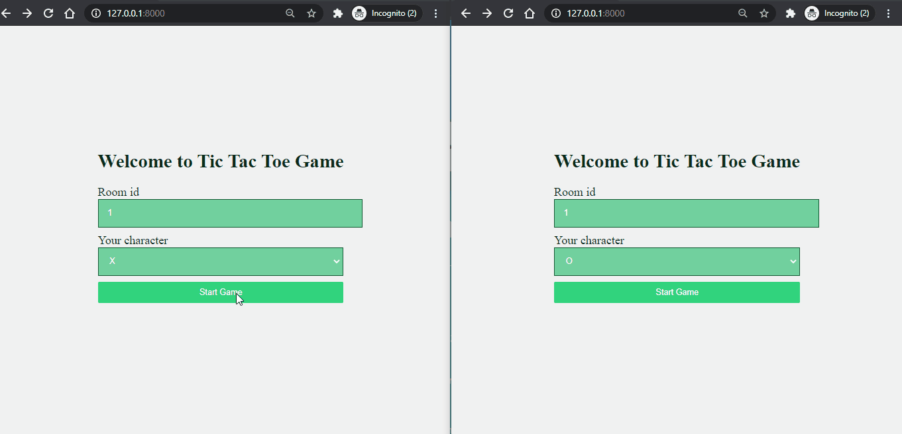

# Django guide for implementing real time application

This is the example project for implementing Tic Tac Toe game. 

Guide link: <link here>

### Installation guide
- Clone repository

	`
	git clone https://github.com/krazygaurav/Django-channels-Tic-Tac-Toe
	`

- cd to repository.

- Create a virtualenv by following command
	- **For Linux/Mac**
	
		`
		virtualenv -p python3 .
		`

	- **For Windows**

		`
			virtualenv .
		`

- Activate virtualenv

	- **For Linux/Mac**
	
		`
			source bin/activate
		`

	- **For Windows**

		`
			.\Scripts\activate
		`

- Install required packages

	- **For Linux/Mac**
		
		`
			pip3 install -r requirements.txt
		`

	- **For Windows**

		`
			pip install -r requirements.txt
		`

- cd to src and run the server
	
	- **For Linux/Mac**
		
		`
			python3 manage.py runserver
		`

	- **For Windows**

		`
			python manage.py runserver
		`
